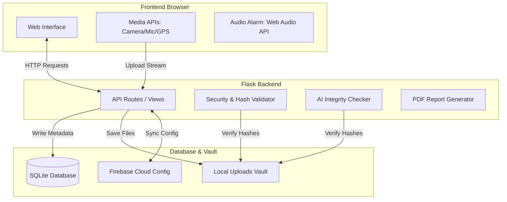

# AI Evidence Protector 🛡️

A secure and lightweight web application for digital evidence preservation, AI integrity auditing, and real-time emergency SOS broadcast.

---

## 🚀 Key Features

* **Digital Vault:** Capture webcam photos and record microphone audio directly from the browser.
* **Cryptographic Signing:** Generates unique SHA-256 hashes instantly for every upload to guarantee chain-of-custody.
* **AI Integrity Audit:** Scans evidence files to detect unauthorized metadata changes or server-side file manipulation.
* **SOS Panic System:** Logs real-time GPS locations and triggers a high-decibel audible browser alarm.
* **PDF Exporter:** Compiles secure incident reports complete with timestamps, coordinates, and digital hashes.

---

## 🛠️ Tech Stack

* **Frontend:** HTML5, CSS3, Vanilla JavaScript (MediaStream & Web Audio APIs)
* **Backend:** Python (Flask)
* **Database:** SQLite (local metadata)

---

## 🏗️ System Architecture



---

## 📂 Project Structure

```
AI_Evidence_Protector/
 ├── .vscode/                 # Workspace configurations & interpreter paths
 ├── backend/
 │    ├── database/           # SQLite schema script (schema.sql)
 │    ├── firebase/           # Firebase initialization & JSON service keys
 │    ├── models/             # Database tables & query handlers
 │    ├── routes/             # API blueprints (Auth, SOS, Vault, AI)
 │    ├── services/           # PDF compiler, storage manager, & AI checking
 │    ├── uploads/            # Secure directory for local media files
 │    ├── app.py              # Main Flask server entry point
 │    ├── requirements.txt    # Python packages list
 │    └── venv/               # Local virtual environment folder
 └── frontend/
      ├── static/             # Client-side CSS, JavaScript, and assets
      └── templates/          # HTML templates (Vault, SOS, Dashboard)
```

---

## ⚙️ Quick Start

### 1. Set Up Environment
Activate the correct virtual environment inside the `backend` directory:
* **Windows (PowerShell):**
  ```powershell
  cd backend
  .\venv\Scripts\Activate.ps1
  ```
* **macOS / Linux:**
  ```bash
  cd backend
  source venv/bin/activate
  ```

### 2. Install Packages
```bash
pip install -r requirements.txt
```

### 3. Run the App
```bash
python app.py
```
Open **`http://localhost:5000`** in your browser.

> [!IMPORTANT]
> **Browser Security Notice:** Always use `http://localhost:5000` or `http://127.0.0.1:5000`. Browsers block camera, microphone, and location access on insecure network IP addresses (like `http://192.168.x.x`).
